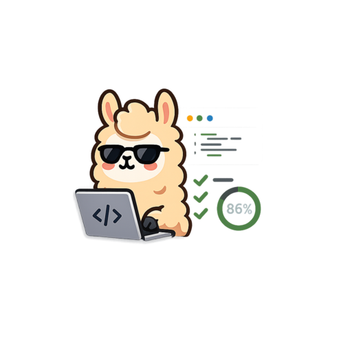

<div align="center">



# SWE-bench-UI

Generic viewer for SWE bench evaluation results. Upload, compare, and analyze SWE bench dumps side-by-side.

[](https://almogtavor.github.io/SWE-bench-UI/)
[](LICENSE)

</div>

## Quick Start

**Online:** [https://almogtavor.github.io/SWE-bench-UI/](https://almogtavor.github.io/SWE-bench-UI/)

**Local:** Open `index.html` in your browser or run a local server:
```bash
python -m http.server 8000
# Open http://localhost:8000
```

## Usage

1. Click "+ Add Dump" to add evaluation result dumps (up to 4)
2. Drag a JSON/JSONL dump file onto a panel or click to browse
3. LiteLLM traces render as one conversation; flat exports show R1, R2... task tabs
4. Use ✨ Parsed for markdown/highlighting and 🧩 Parse API for tool-call decoding
5. Saved uploads appear in the left library, drag them into folders to organize

## Supported Formats

- Direct SWE bench result exports (JSON)
- Baseline/SPANS nested format
- JSONL format (line-delimited LiteLLM traces)
- Simple request/response arrays

## Features

- LiteLLM trace.jsonl stitched into one scrollable conversation (per-call steps, thought + code IN/OUT, collapsible system prompt)
- Markdown rendering with Python/JSON syntax highlighting (toggleable)
- "Parse API" mode: decode raw litellm/OpenAI `Choices()` reprs into readable tool-call cards
- Local library sidebar: folders, per-trace/folder resolved counts (3/12), and bundle export/import
- Shareable links: traces are gzip-compressed into the URL fragment, no backend (🔗 Share)
- Side-by-side comparison of up to 4 dumps
- Works with any SWE bench export (JSON, JSONL, baseline/SPANS)

## License

MIT
